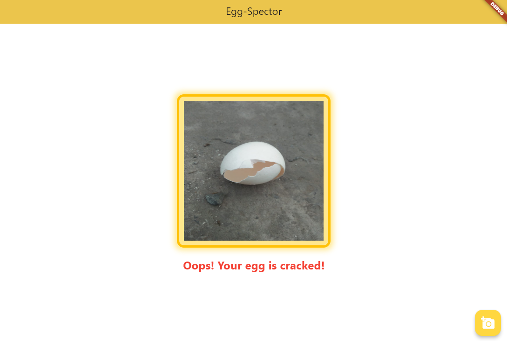

# Egg-Spector

**Egg-Spector** is a full-stack application allowing users to upload images of eggs, and determines whether the egg is broken.
Runs on a convolutional neural network developed in separate repository: https://github.com/PaulOberg1/cnn-from-scratch

## Features:
- Contains image-upload feature for users to upload .png and .jpg images of eggs.
- Converts photos into Eigen Matrix format and pipelines the data through convolutional neural network.
- Displays whether the egg is broken on the Flutter frontend.

## Technologies:
- **Backend:** C++, Eigen
- **Frontend:** Flutter (Dart)
